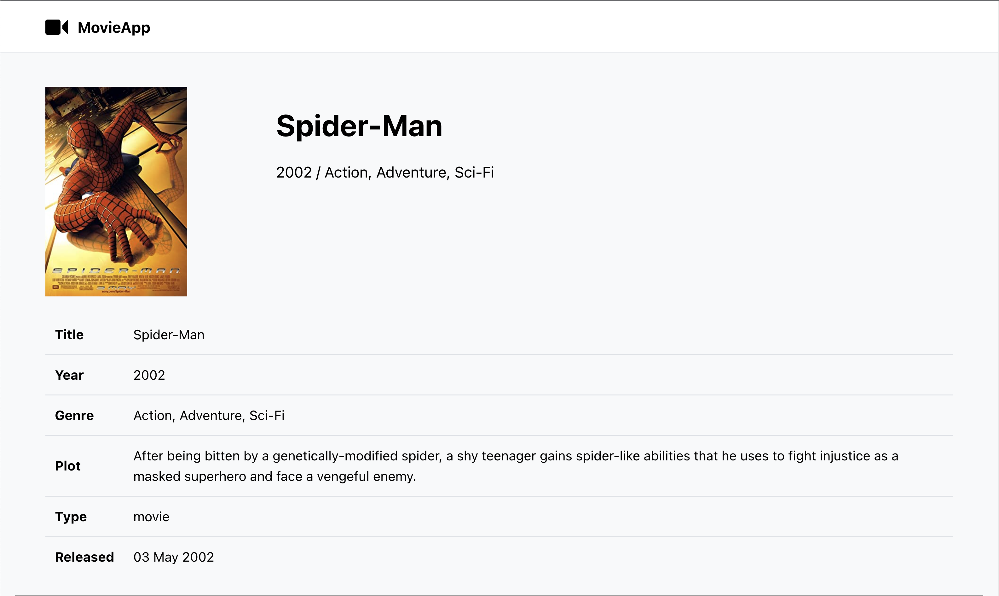

# React + TypeScript + Vite

### MovieDB - App

Diese Aufgabe besteht darin, eine Anwendung mit ReactJS zu entwickeln, die es Benutzern ermöglicht, Filme und Episoden mithilfe der "OMDb API" (https://www.omdbapi.com/) zu suchen. Für das Styling verwenden wir Tailwind CSS und für die Typisierung TypeScript. Um die Datenabfrage und -verwaltung zu erleichtern, verwenden wir die Bibliothek "React Query". Für die Validierung der Formulare nutzen wir "React Hook Form" in Kombination mit "Yup" für das Schema-Validierungssystem.

Anforderungen:

- Implementiere eine Suchfunktion für Filme und Episoden mithilfe der OMDb API.
- Die Suche sollte mit React Query verwaltet werden, um Datenabfragen, Caching und Fehlerbehandlung zu vereinfachen.
- Verwende React Hook Form, um das Suchformular zu erstellen und Yup zur Validierung der Eingaben.
- Zeige die Ergebnisse in einer Liste an, die auf der Seite wie in den Screenshots gezeigt dargestellt wird.
- Beim Klick auf einen Film oder eine Episode sollte eine Detailansicht geöffnet werden. Verwende hierfür die dynamischen Routen von React Router.
- Stelle sicher, dass die Anwendung responsive ist und sich an verschiedene Bildschirmgrößen anpasst.
- Zeige entsprechende Fehlermeldungen an, wenn etwas schiefgeht, z. B. wenn die API-Anfrage fehlschlägt oder die Validierung der Formulare fehlschlägt.

Technologiestack:

- ReactJS
- Tailwind CSS
- TypeScript
- React Query
- React Hook Form
- Yup
- React Router

